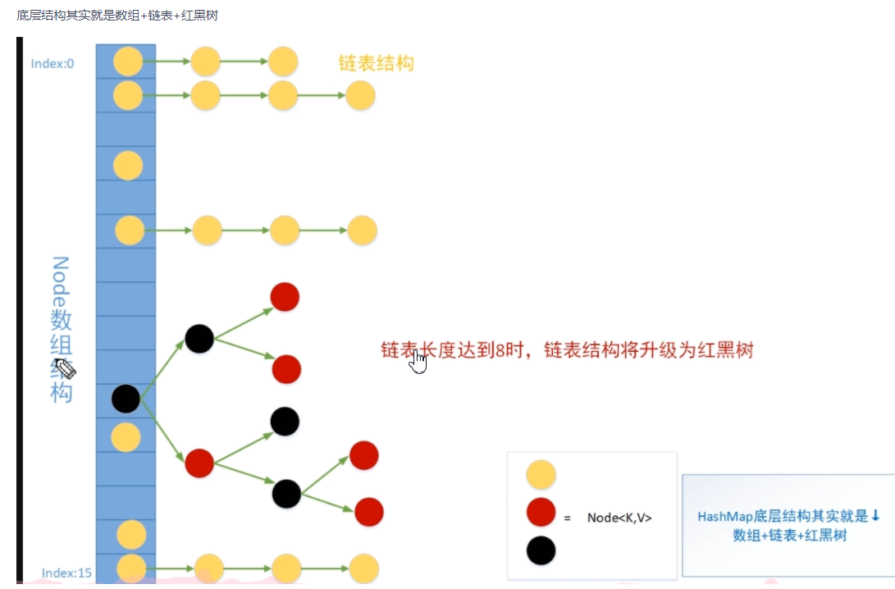
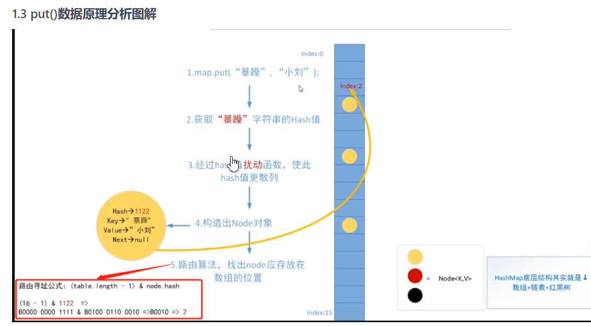
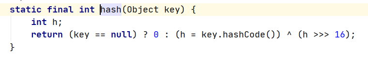

# Hashmap


### 优点

​					数组优势:快速索引

​					链表:可以动态扩容,不需要重新创建



#### hash:

​			任意长度的输入,通过hansh算法变成固定长度的输出,这个映射规则就是hash算法

特点:

​		无法从hash值推算出原始数据

​		输入数据微小变化就会得到完全不同的hash值,相同的数据得到相同的hash值

​		执行效率高效

​		hash算法冲突效率要小

### 名词解释

​			hashmap的底层数据结构名为table的数组，是一个Node数组

​			table数组中的每个元素是一个Node元素（但是这个Node元素可能指向下一个Node元素从而形成链表），		table数组的每个位置称为桶，比如talbe[0] 称为一个桶，也可以称为一个bin


### 树化

​			static final int MIN_TREEIFY_CAPACITY = 64;  #数组table的长度至少是64

​			static final int TREEIFY_THRESHOLD = 8;       #链表的长度至少是8

​			

### 扰动函数

​				作用是:让key的高16位也参与运算,让hash值散布更加均匀



> - [ ] ```java
>     /**
>     	*
>     	* tab表示当前hashmap的table
>       * p表示table的元素
>       * n表示散列表的长度
>       * i表示路由寻址结果
>     	*
>      /*
>   final V putVal(int hash, K key, V value, boolean onlyIfAbsent,
>                      boolean evict) {
>           Node<K,V>[] tab; Node<K,V> p; int n, i;
>           //没有初始化,懒加载,第一次put数据的时候才会resize
>           if ((tab = table) == null || (n = tab.length) == 0)
>               n = (tab = resize()).length;
>           //下角标index寻址: hash&(table.lenght()-1),如果寻址刚好是null,将当前k,v封装成			// node装进去  
>           if ((p = tab[i = (n - 1) & hash]) == null)
>               tab[i] = newNode(hash, key, value, null);
>           else {
>           	//e:node元素
>           	//K:临时key
>               Node<K,V> e; K k;
>               if (p.hash == hash &&
>                   ((k = p.key) == key || (key != null && key.equals(k))))
>                   e = p;
>               else if (p instanceof TreeNode)
>                   e = ((TreeNode<K,V>)p).putTreeVal(this, tab, hash, key, value);
>               else {
>                   for (int binCount = 0; ; ++binCount) {
>                       if ((e = p.next) == null) {
>                           p.next = newNode(hash, key, value, null);
>                           if (binCount >= TREEIFY_THRESHOLD - 1) // -1 for 1st
>                               treeifyBin(tab, hash);
>                           break;
>                       }
>                       if (e.hash == hash &&
>                           ((k = e.key) == key || (key != null && key.equals(k))))
>                           break;
>                       p = e;
>                   }
>               }
>               if (e != null) { // existing mapping for key
>                   V oldValue = e.value;
>                   if (!onlyIfAbsent || oldValue == null)
>                       e.value = value;
>                   afterNodeAccess(e);
>                   return oldValue;
>               }
>           }
>           ++modCount;
>           if (++size > threshold)
>               resize();
>           afterNodeInsertion(evict);
>           return null;
>       }
>   ```