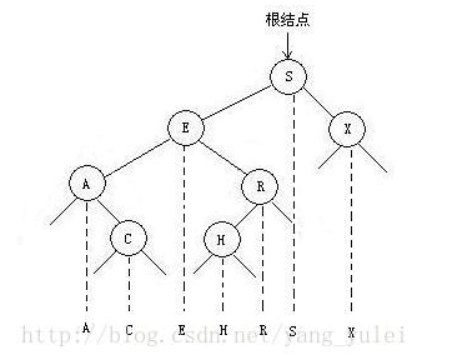
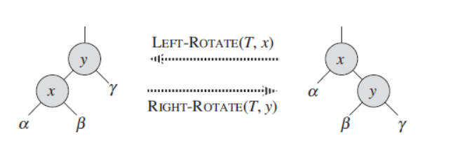
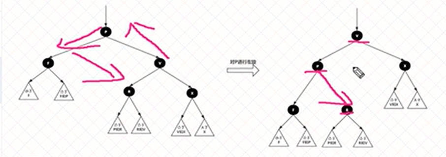
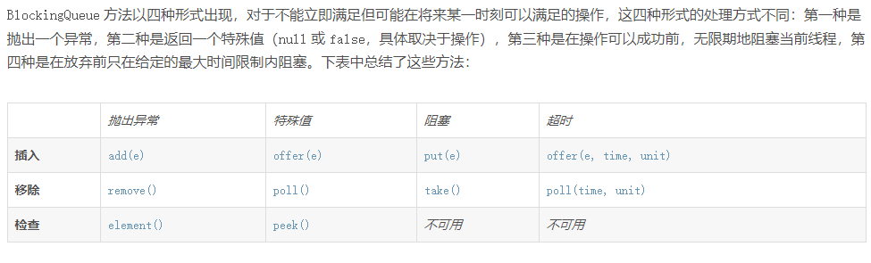

# Hashmap

参考:https://blog.csdn.net/CSDN_WYL2016/article/details/106738266

### 优点

​					数组优势:快速索引

​					链表:可以动态扩容,不需要重新创建


#### hash:

​			任意长度的输入,通过hansh算法变成固定长度的输出,这个映射规则就是hash算法

特点:

​		无法从hash值推算出原始数据

​		输入数据微小变化就会得到完全不同的hash值,相同的数据得到相同的hash值

​		执行效率高效

​		hash算法冲突效率要小

### 名词解释

​			hashmap的底层数据结构名为table的数组，是一个Node数组

​			table数组中的每个元素是一个Node元素（但是这个Node元素可能指向下一个Node元素从而形成链表），		table数组的每个位置称为桶，比如talbe[0] 称为一个桶，也可以称为一个bin


### 树化

​			static final int MIN_TREEIFY_CAPACITY = 64;  #数组table的长度至少是64

​			static final int TREEIFY_THRESHOLD = 8;       #链表的长度至少是8

​			

### 扰动函数

​				作用是:让key的高16位也参与运算,让hash值散布更加均匀


```java
  /**
  	*
  	* tab表示当前hashmap的table
    * p表示table的元素
    * n表示散列表的长度
    * i表示路由寻址结果
  	*
   /*
final V putVal(int hash, K key, V value, boolean onlyIfAbsent,
                   boolean evict) {
        Node<K,V>[] tab; Node<K,V> p; int n, i;
        //没有初始化,懒加载,第一次put数据的时候才会resize,避免创建后不放数据,占据空间
        if ((tab = table) == null || (n = tab.length) == 0)
            n = (tab = resize()).length;
        //下角标index寻址: hash&(table.lenght()-1),如果寻址刚好是null,将当前k,v封装成					//node装进去, =null表示没有数据,刚好存进去  
        if ((p = tab[i = (n - 1) & hash]) == null)
            tab[i] = newNode(hash, key, value, null);
        else {
        	//e:不为null的话,找到了一个与当前kv相同的key的元素
            //K:表示临时key
            Node<K,V> e; K k;
            // p.hash==hash表示与当前插入元素的key完全相同,后续需要进行替换操作
            if (p.hash == hash &&
                ((k = p.key) == key || (key != null && key.equals(k))))
                e = p;
            else if (p instanceof TreeNode)
                e = ((TreeNode<K,V>)p).putTreeVal(this, tab, hash, key, value);
            else {
            	//链表:链表的头元素和我们要插入的key不一致
                for (int binCount = 0; ; ++binCount) {
                	//条件成立的话: 说明迭代到最后一个元素,也没找到一个与我们要插入的key一致的node
                	//,说明我们需要加入到当前链表的末尾
                    if ((e = p.next) == null) {
                        p.next = newNode(hash, key, value, null);
                      //条件成立的话,说明链表的长度达到标准了,需要进行树化处理
                        if (binCount >= TREEIFY_THRESHOLD - 1) // -1 for 1st
                            treeifyBin(tab, hash);
                        break;
                    }
                    //条件成立的话:说明找到了相同key的node元素,需要进行替换操作
                    if (e.hash == hash &&
                        ((k = e.key) == key || (key != null && key.equals(k))))
                        break;
                    p = e;
                }
            }
            //成立说明:找到一个与插入元素key完全一致的数据,需要进行替换
            if (e != null) { // existing mapping for key
                V oldValue = e.value;
                if (!onlyIfAbsent || oldValue == null)
                    e.value = value;
                afterNodeAccess(e);
                return oldValue;
            }
        }
        //modeCount:表示散列表结构被修改的次数,替换元素的value不算(+-操作)
        ++modCount;
     	//插入新元素,size自增,如果自增后的size大于阈值,触发扩容
        if (++size > threshold)
            resize();
        afterNodeInsertion(evict);
        return null;
    }
```


### resize

```java

final Node<K,V>[] resize() {
    	//oldTab:用于扩容前的hash表
        Node<K,V>[] oldTab = table;
    	//oldCap:扩容前table数组的长度
        int oldCap = (oldTab == null) ? 0 : oldTab.length;
    	//oldThr:扩容之前的扩容阈值,触发本次扩容的阈值
        int oldThr = threshold;
   		 //newCap:扩容之后的数组大小
    	//newThr:  扩容之后,下次再触发扩容的条件
        int newCap, newThr = 0;
    	//条件成立: hashmap中的数列表已经初始化了,是一次正常的扩容
        if (oldCap > 0) {
            //数组已经达到最大阈值,以后无法再扩容
            if (oldCap >= MAXIMUM_CAPACITY) {
                threshold = Integer.MAX_VALUE;
                return oldTab;
            }
            //oldcap左移1位,并赋值给newcap,newcap小于最大阈值,同时oldcap大于16
            //这种情况下,则下次扩容的阈值翻倍
            else if ((newCap = oldCap << 1) < MAXIMUM_CAPACITY &&
                     oldCap >= DEFAULT_INITIAL_CAPACITY)
                newThr = oldThr << 1; // double threshold
        }
    	//oldcap==0,说明散列表没有初始化,
        else if (oldThr > 0) // initial capacity was placed in threshold
            newCap = oldThr;
    	//oldThr=0,oldCap=0
        else {               // zero initial threshold signifies using defaults
            newCap = DEFAULT_INITIAL_CAPACITY;
            newThr = (int)(DEFAULT_LOAD_FACTOR * DEFAULT_INITIAL_CAPACITY);
        }
    	//newThr=0
        if (newThr == 0) {
            float ft = (float)newCap * loadFactor;
            newThr = (newCap < MAXIMUM_CAPACITY && ft < (float)MAXIMUM_CAPACITY ?
                      (int)ft : Integer.MAX_VALUE);
        }
        threshold = newThr;
    	
   		//创建一个新的更长更大的数组
        @SuppressWarnings({"rawtypes","unchecked"})
            Node<K,V>[] newTab = (Node<K,V>[])new Node[newCap];
        table = newTab;
    	//说明hash本次扩容之前,table不是null
        if (oldTab != null) {
            for (int j = 0; j < oldCap; ++j) {
                //e:当前node节点
                Node<K,V> e;
                //说明当前桶位有数据,但是具体是链表还是红黑树不确定
                if ((e = oldTab[j]) != null) {
                    //方便jvm GC时候回收内存
                    oldTab[j] = null;
                    //当前桶位只有一个元素,从未发生过碰撞,直接计算出在新数组中的位置,然后扔进去就可以
                    if (e.next == null)
                        newTab[e.hash & (newCap - 1)] = e;
                    //当前节点已经树化,
                    else if (e instanceof TreeNode)
                        ((TreeNode<K,V>)e).split(this, newTab, j, oldCap);
                    //
                    else { // preserve order
                        //低位链表:存放扩容之后数组的下标位置,与当前数组下标位置是一致的
                        Node<K,V> loHead = null, loTail = null;
                        //高位列表,存放扩容之后数组的下标位置,与当前数组下标位置+扩容之前数组的长度
                        Node<K,V> hiHead = null, hiTail = null;
                        Node<K,V> next;
                        do {
                            next = e.next;
                            //hash--->1 11111
                            //hash--->0 11111
                            // oldcap: 10000
                            //结果出来: 首位要么是0 要么是1, 也就是低位继续15, 高位到31
                            if ((e.hash & oldCap) == 0) {
                                if (loTail == null)
                                    loHead = e;
                                else
                                    loTail.next = e;
                                loTail = e;
                            }
                            else {
                                if (hiTail == null)
                                    hiHead = e;
                                else
                                    hiTail.next = e;
                                hiTail = e;
                            }
                        } while ((e = next) != null);
                        //
                        if (loTail != null) {
                            loTail.next = null;
                            newTab[j] = loHead;
                        }
                        if (hiTail != null) {
                            hiTail.next = null;
                            newTab[j + oldCap] = hiHead;
                        }
                    }
                }
            }
        }
        return newTab;
    }
```


# 红黑树

### 		二叉搜索树

​					每个结点的键都大于其左子树中的任意结点的键而小于右子树的任意结点的键

​					左右子树叶分别是二叉排序树

​					如果我们将一颗二叉查找树的所有键**投影**到一条直线上，保证一个结点的左子树中的键出现在它的右					边，右子树中的键出现在它的右边，那么我们一定可以得到一条有序的键列。

​					

​				

```java
public class BinarySearchTest {
    public static void main(String[] args) {
        int[] arr = new int[]{1, 2, 4, 5, 6, 7, 8, 8, 8, 12, 1};
        System.out.println(BinarySearchTest(arr, 12));
    }
    public static int BinarySearchTest(int[] arr, int data) {
        int low = 0;
        int heig = arr.length - 1;
        while (low <= heig) {
            int mid = low + (heig - low) / 2;
            if (arr[mid] < data) {
                low = mid + 1;
            } else if (arr[mid] == data) {
                return mid;
            } else {
                heig = mid - 1;
            }
        }
        return -1;
    }
}
```

### 平衡二叉树

​			左右子树的高度差至多等于1

### 红黑树

​			每个节点要么黑色,要么红色

​			根节点是黑色

​			每个叶子结点(NIL)黑色

​			每个红色节点的两个子节点是黑色的,不能有2个红色节点相连接

​			任意一个节点到叶子节点的路径都包含数量相同的黑节点,俗称 "黑高"

​			(黑色完美平衡:靠的是 左旋,右旋,变色)

​			左旋:x 节点的左旋就是把 x 变成 右孩子 y 的左孩子，同时把 y 的左孩子送给 x 当右子树。






# Queue




## ArrayBlockingQueue

一个由数组结构组成的有界阻塞队列。必须指定大小

## LinkedBlockingQueue

一个由链表结构组成的有界阻塞队列。此队列的默认和最大长度为 Integer.MAX_VALUE

## SynchronousQueue

是一个不存储元素的阻塞队列。每一个put操作必须等待一个take操作，否则不能继续添加元素。

