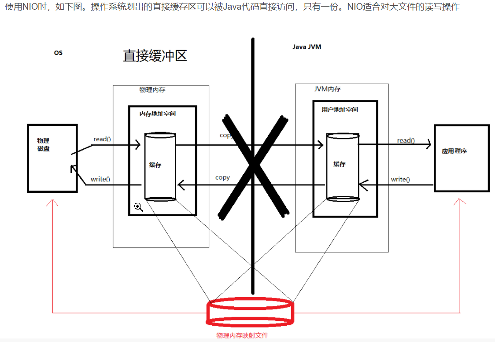

### 对象是否相等

​				类的完整类名必须一致，包括包名

​				加载这个类的 ClassLoader（指ClassLoader实例对象）必须相同

###  双亲委派机制

​			如果一个类加载器收到了类加载请求，它并不会自己先去加载，而是把这个请求委托给父类的加载器去执行；

​			如果父类加载器还存在其父类加载器，则进一步向上委托，依次递归，请求最终将到达顶层的启动类加载器；

​			如果父类加载器可以完成类加载任务，就成功返回，倘若父类加载器无法完成此加载任务，子加载器才会尝试自己去加载，这就是双亲委派模式。

​			父类加载器一层一层往下分配任务，如果子类加载器能加载，则加载此类，如果将加载任务分配至系统类加载器也无法加载此类，则抛出异常


###  双亲委派机制的优势

​				避免类的重复加载

​				保护程序安全，防止核心API被随意篡改

​								自定义类：java.lang.String 没有调用

​								自定义类：java.lang.ShkStart（报错：阻止创建 java.lang开头的类）

### 运行时数据区

#### PC计数器

​				**不会出现OutofMemoryError**,会出现**StackOverflowError**

​				在JVM规范中，每个线程都有它自己的程序计数器是**线程私有**的,生命周期与线程的生命周期保持一致

​				**作用:** PC寄存器用来存储指向下一条指令的地址，也就是即将要执行的指令代码。由执行引擎读取下一条指令，并执行该指令

```java
public static void main(String[] args) {
        main(args);
    }
```

​				设置大小:  -Xss1024m

​			


32bit的类型占用一个栈单位深度(slot)      64bit的类型占用两个栈单位深度(2个slot,**long和double**)


#### 常量池&运行时..&字符串..

​			**常量池(constant pool table**:  静态信息,字节码文件中,各种字面量和对类型、域和方法的符号引用,这部分内容将在类加载后存放到方法区的运行时常量池中。

​			**运行时常量池（Runtime Constant Pool）:**方法区的一部分,


#### **String Tabble字符串常量池**

jdk1.7： 有永久代但是已经逐步 “去永久代”， 字符串常池从**永久代**里的运行时常量池分离到**堆**中

jdk1.8 以及之后:无永久代，**运行时常量池在元空间**，**字符串常量池依然在堆里**

JDK7中将**StringTable放到了堆空间**中。因为**永久代的回收效率很低**，在Full GC的时候才会执行永久代的垃圾回收，而Full GC是老年代的空间不足、永久代不足时才会触发。
这就导致StringTable回收效率不高，而我们开发中会有大量的字符串被创建，回收效率低，导致永久代内存不足。**放到堆里，能及时回收内存**。

```java
/**
 * VM args: -Xms10M -Xmx10M
 */
public class RuntimeConstantPoolOOM {

    public static void main(String[] args) {

        ArrayList<String> list = new ArrayList<>();
        for (int i = 0; i < 1000000; i++) {
            for (int j = 0; j < 10000000; j++) {
                list.add(String.valueOf(i + j / 1000000).intern());
            }
        }
    }
}
//jdk1.7 以及以上 Exception in thread "main" java.lang.OutOfMemoryError: Java heap space
```


### Heap

​			设置大小: -Xms10m -Xmx10m(一旦堆区中的内存大小超过“-Xmx”所指定的最大内存时，将会抛出OutofMemoryError)

​			通常会将-Xms和-Xmx两个参数**配置相同的值**，其目的是为了能够在Java垃圾回收机制清理完堆区后不需要重新分隔计算堆区的大小，从而提高性能。

​			**默认情况下:  初始内存大小：物理电脑内存大小/64  和最大内存大小：物理电脑内存大小/4**

​		参看参数:

​					-XX: PrintGCDetails		

**元空间不在虚拟机设置的内存中，而是使用本地内存**


#### 对象分配


#### 堆参数

- -XX:PrintFlagsInitial: 查看所有参数的默认初始值
- -XX:PrintFlagsFinal：查看所有的参数的最终值（可能会存在修改，不再是初始值）

-XX:+PrintGCDetails：输出详细的GC处理日志

- 打印gc简要信息：① -XX:+PrintGC ② -verbose:gc

具体查看某个参数的指令：

- jps：查看当前运行中的进程
- jinfo -flag SurvivorRatio 进程id： 查看新生代中Eden和S0/S1空间的比例

#### 逃逸分析

​		如何快速的判断是否发生了逃逸分析，就看new的对象实体是否有可能在方法外被调用

#### JVM进程


#### 内存结构


#### 交互关系


#### 元空间

​		元空间并不在虚拟机中，而是使用**本地内存**。因此，默认情况下，**元空间的大小仅受本地内存限制**。

#### 运行时数据区

​		运行时数据区

		


#### BIO&NIO




#### GC触发

#### 			**Minor GC**

​						Eden代满，Survivor满不会引发GC.(每次Minor GC会清理年轻代的内存，Survivor是被动GC，不会主动GC),引发STW

#### 	    	**Major GC**

​						 老年代空间不足时，会先尝试触发Minor GC。如果之后空间还不足，则触发Major GC,Major GC速度一般会比Minor GC慢10倍以上，STW时间更长;如果Major GC后，内存还不足，就报OOM了	

#### 		    Full GC

​							Full GC定义是相对明确的，就是针对整个新生代、老生代、元空间（metaspace，java8以上版本取代perm gen）的全局范围的GC；

#### 			方法区演变

​							jdk1.7：有永久代，但已经逐步“去永久代”，字符串常量池、静态变量移除，保存在堆中

​							jdk1.8及之后： 无永久代，类型信息、字段、方法、常量保存在本地内存的元空间，但字符串常量池、静态变量仍在堆

#### 				**new Sttring()**

​							https://blog.csdn.net/qq_43012792/article/details/107428707

​							new String(“ab“)到底创建了几个对象？  2个

​							

​							**单纯执行new String(“XXX”)，底层会创建两个对象。一个是在堆中创建XXX的对象，另一个是在堆中字符串常量池中创建。这两个对象的内容都是一样的，但是地址是不相同的**

​							ldc:命令,从常量池中创建,然后加载到栈中

​							

​							String str = new String("a") + new String("b")创建了几个对象?

​								6个对象

​							


#### String的基本特性

​				创建:

​				 **方式一：String str1 = “qingdianguanzhu”**。// 字面量定义的方式，数据存储于字符串常量池中

​				**方式二：String str2 = new String (“hello”)**(**可以使用 String 提供的 intern () 方法**。


### 可达性分析

#### 				GCRoot:

​								1.所有被同步锁synchroni zed持有的对象

​								2.Java虚拟机内部的引用()基本数据类型对应的Class对象，一些常驻的异常对象（如： NullPointerException、OutOfMemoryError） ，系统类加载器

​								3.方法区中常量引用的对象

​								4.方法区中类静态属性引用的对象(Java类的引用类型静态变量)

   							  5.虚拟机栈中引用的对象(各个线程被调用的方法中使用到的参数、局部变量等。)

​					**标记的时候会导致STW**

### 标记一清除算法（Mark一Sweep)


### 复制（Copying）算法

​			前提:复制算法的高效性是建立在存活对象少、垃圾对象多的前提下的。


### 标记-压缩(整理,Mark-Compact)算法


### 全能知识点

https://juejin.cn/post/6844904125696573448

### 垃圾回收器

#### 			工作模式


#### GC的性能指标

​			吞吐量：运行用户代码的时间占总运行时间的比例（总运行时间：程序的运行时间十内存回收的时间）

​			暂停时间：执行垃圾收集时，程序的工作线程被暂停的时间

## Serial回收器


## ParNew回收器


## Parallel回收器:吞吐量优先


## CMS回收器


## GC选择

如果你想要最小化地使用内存和并行开销，请选Serial GC；
如果你想要最大化应用程序的吞吐量，请选Parallel GC；
如果你想要最小化GC的中断或停顿时间，请选CMS GC。

## G1


## 垃圾回收器总结


## GC日志

​				https://juejin.cn/post/6844904200678146061#heading-40

​				一XX： +PrintGCDetails 输出GC的详细日志

​				一Xloggc：. . /logs/gc. log日志文件的输出路径


### spring.factories如何加载?

​	参考:https://zhuanlan.zhihu.com/p/163715640

### @Import注解

参考: https://blog.csdn.net/mlplds/article/details/102826671


AOP源码

参考: https://blog.csdn.net/java_yes/article/details/98209495

参考: https://cloud.tencent.com/developer/article/1661912


### Feign源码

https://tech.souyunku.com/?p=37451

https://tech.souyunku.com/?cat=62


### Redis集群创建

​		注意事项:

​					参考这个: https://blog.csdn.net/qq_42815754/article/details/82912130

​					注意修改:  client.rb 里面的host地址(find / -name client.rb )

​					注意修改: 每个redis的 redis.conf里面的

​								端口, cluster-enable yes, protect-mod:yes 和bind的ip(和client.tb里面的ip相同)

​					启动命令:

​									./redis-trib.rb create --replicas 1 172.16.99.231:6380  172.16.99.231:6381  172.16.99.231:6382  172.16.99.231:6383  172.16.99.231:6384  172.16.99.231:6385

​						

