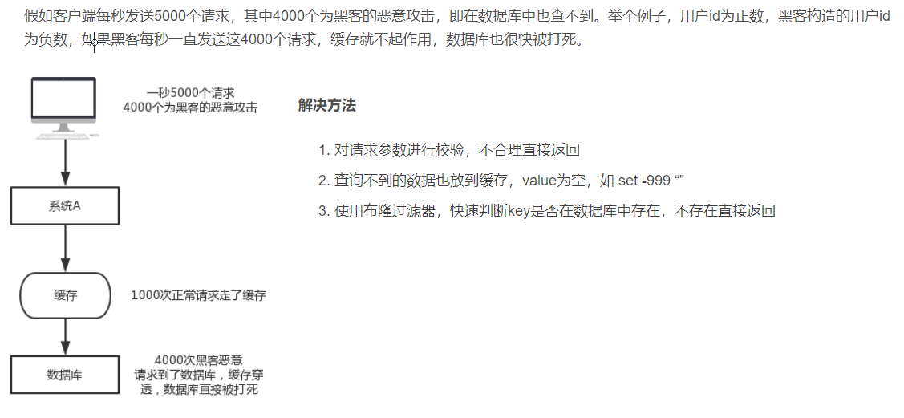
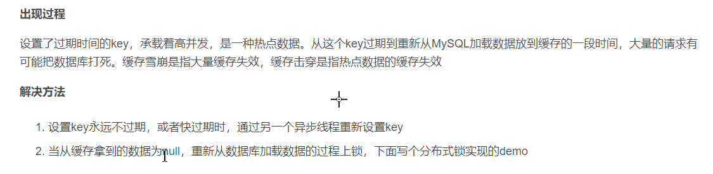
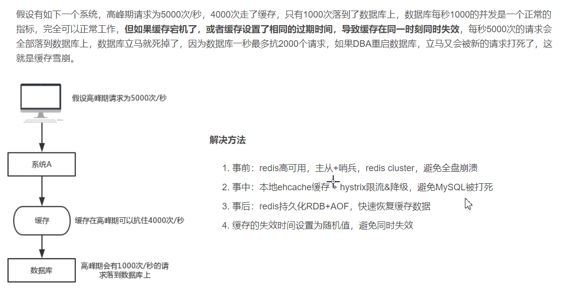
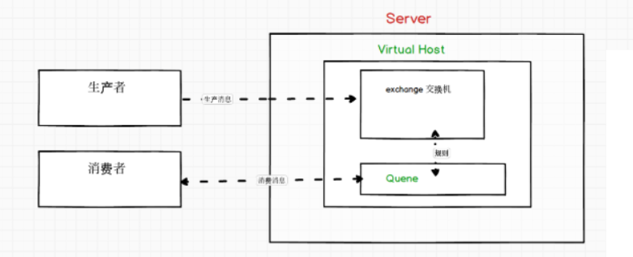
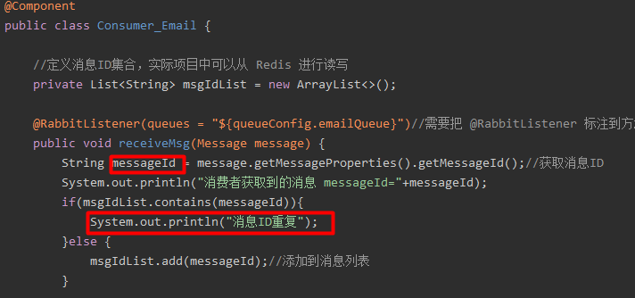

# 缓存

### 缓存穿透

(缓存没有储存被访问数据）



### 缓存击穿

（一个被访问数据刚好过期删除）

参考:https://blog.csdn.net/zzti_erlie/article/details/104655455?utm_medium=distribute.pc_relevant.none-task-blog-2%7Edefault%7EBlogCommendFromMachineLearnPai2%7Edefault-1.control&dist_request_id=1331989.1079.16187350079168957&depth_1-utm_source=distribute.pc_relevant.none-task-blog-2%7Edefault%7EBlogCommendFromMachineLearnPai2%7Edefault-1.control



### 缓存雪崩

（多个被访问数据刚好过期删除）



参考:https://blog.csdn.net/sanyaoxu_2/article/details/79472465?utm_medium=distribute.pc_relevant.none-task-blog-baidujs_baidulandingword-0&spm=1001.2101.3001.4242


### 缓存更新策略

​		**先删缓存再更新数据库**: 导致缓存数据和数据库数据不一致,(删除缓存后到数据插入之前会导致去读数据库中的老数据并缓存,直到数据过期,这段时间的都是老数据,导致数据不一致)

​    	**先更新数据库再删缓存:**业界常用方案,出现问题几率比较低

https://zhuanlan.zhihu.com/p/86396877


### 序列化

```java
@Configuration
public class MyRedisConfig {

    @Bean(name = "redisTemplate")
    public RedisTemplate<String, Object> redisTemplate(RedisConnectionFactory redisConnectionFactory){
        RedisTemplate<String, Object> redisTemplate = new RedisTemplate<>();
        //参照StringRedisTemplate内部实现指定序列化器
        redisTemplate.setConnectionFactory(redisConnectionFactory);
        redisTemplate.setKeySerializer(keySerializer());
        redisTemplate.setHashKeySerializer(keySerializer());
        redisTemplate.setValueSerializer(valueSerializer());
        redisTemplate.setHashValueSerializer(valueSerializer());
        return redisTemplate;
    }

    private RedisSerializer<String> keySerializer(){
        return new StringRedisSerializer();
    }

    //使用Jackson序列化器
    private RedisSerializer<Object> valueSerializer(){
        return new GenericJackson2JsonRedisSerializer();
    }
}
```

https://zhuanlan.zhihu.com/p/352603005

# RabbitMq



​	查看状态: systemctl status rabbitmq-server   

​	查看所有插件:   rabbitmq-plugins  list  

常用命令: https://www.cnblogs.com/potato-chip/p/9977386.html

​				  https://blog.51cto.com/qiangsh/2444489

常用参数配置:

​					https://blog.csdn.net/girlgolden/article/details/97915368

补偿机制:

https://blog.csdn.net/BiandanLoveyou/article/details/115534476

### 重试机制

RabbitMQ 重试机制会引起什么问题？答：幂等性问题。

MQ 重试机制原因:  1、网络延迟。2、消费者出现异常。3、消费者延迟消费等，都可能造成 MQ 触发重试机制




### 配置详情

https://zhuanlan.zhihu.com/p/366215130