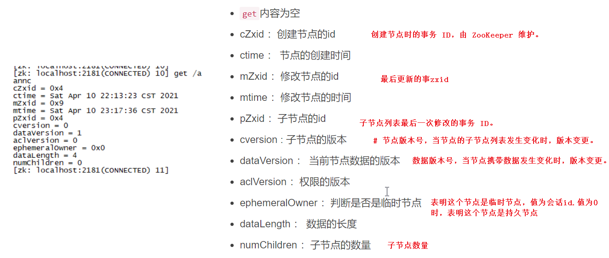
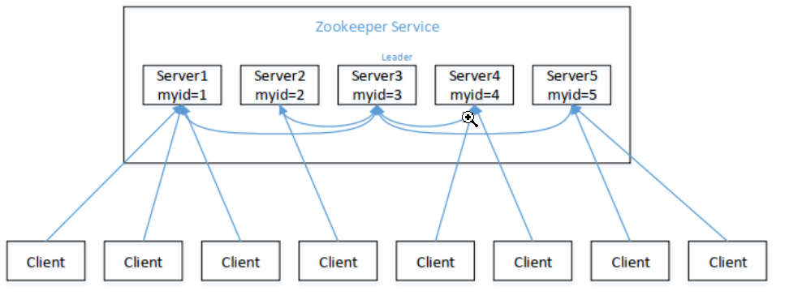

# 常用命令

​	单机启动:   ./zkServer.sh  start

​	状态查看: ./zkServer.sh   status

​	停止服务: ./zkServer.sh stop

​	重启 服务：./zkServer.sh restart

​	查看:   ls /key

​	创建临时节点: create -e  /key  value

​	创建永久节点: create -s /key value   (客户端quit之后就不存在)

​	修改值:  set /key   value

​	修改值(版本号) :  set /key value  版本号   (如果版本号错误,无法修改)

​	删除节点:  rmr /key  (删除节点,包含子节点)

   权限:`CREATE`、`READ`、`WRITE`、`DELETE`、`ADMIN` 也就是 增、删、改、查、管理权限，这5种权限简写为`crwda`(即：每个单词的首字符缩写)。

​	身份认证:

​	 `world`：默认方式，相当于全世界都能访问

​	`auth`：代表已经认证通过的用户(cli中可以通过addauth digest user:pwd 来添加当前上下文中的授权用户)

​	**digest**：即用户名:密码这种方式认证，这也是业务系统中最常用的

​     **ip**：使用Ip地址认证

​	查看权限:  getAcl  /key

​	设置 权限: 

​	

# 参数

​			参考:https://www.cnblogs.com/linjiqin/archive/2013/03/16/2963439.html

​		tickTime=2000		心跳单位

​		initLimit=10			Leader允许F在**initLimit**时间内完成这个工作。(10*tickTime)

​		syncLimit=5			在运行过程中，Leader负责与ZK集群中所有机器进行通信,超过这个时间,会默认掉线										(5*tickTime)

# 选举机制

**半数机制**：集群中半数以上机器存活，集群可用。所以 Zookeeper 适合安装奇数台服务器。例如，5台服务器有3台存活，集群可用，而只有2台存活，集群不可用

**选举机制**:Zookeeper 虽然在配置文件中并没有指定 Master 和 Slave。 但是， Zookeeper 工作时，是有一个节点为 Leader，其他则为 Follower， Leader 是通过**内部的选举机制**临时产生的

**1.**服务器 1 启动， 发起一次选举。服务器 1 投自己一票。此时服务器 1 票数一票，不够半数以上（3 票），选举无法完成，服务器 1 状态保持为 LOOKING；
**2.**服务器 2 启动， 再发起一次选举。服务器 1 和 2 分别投自己一票并交换选票信息：此时服务器 1 发现服务器 2 的 ID 比自己目前投票推举的（服务器 1）大，更改选票为推举服务器 2。此时服务器 1 票数 0 票，服务器 2 票数 2 票，没有半数以上结果，选举无法完成，服务器 1， 2 状态保持 LOOKING
**3.**服务器 3 启动， 发起一次选举。此时服务器 1 和 2 都会更改选票为服务器 3。此次投票结果：服务器 1 为 0 票，服务器 2 为 0 票，服务器 3 为 3 票。此时服务器 3 的票数已经超过半数，服务器 3 当选 Leader。服务器 1， 2 更改状态为 FOLLOWING，服务器 3 更改状态为 LEADING；
**4.**服务器 4 启动， 发起一次选举。此时服务器 1， 2， 3 已经不是 LOOKING 状态，不会更改选票信息。交换选票信息结果：服务器 3 为 3 票，服务器 4 为 1 票。此时服务器 4服从多数，更改选票信息为服务器 3，并更改状态为 FOLLOWING；

**5.**服务器 5 启动，同 4 一样当小弟。

**会投给ID号比较大的**