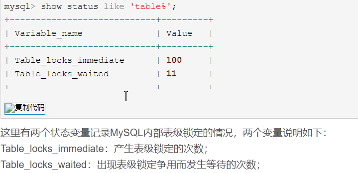
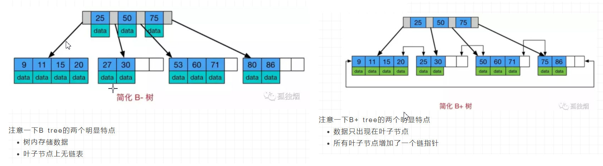
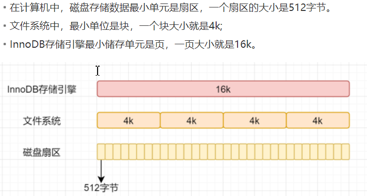
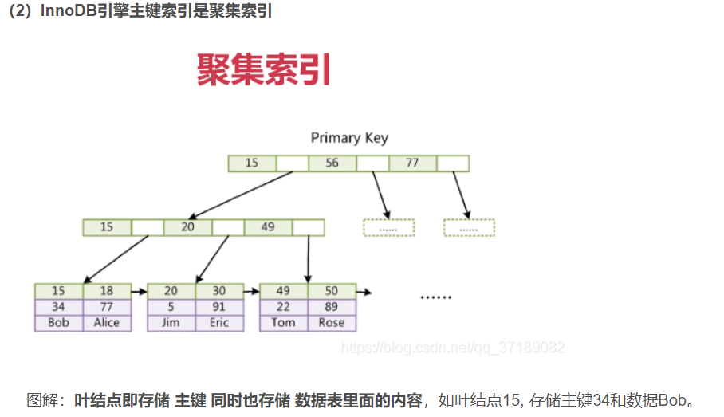
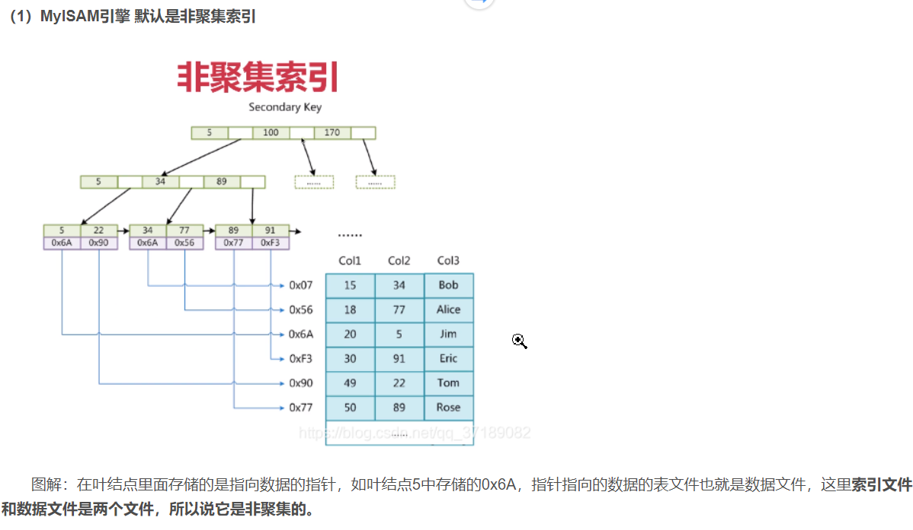
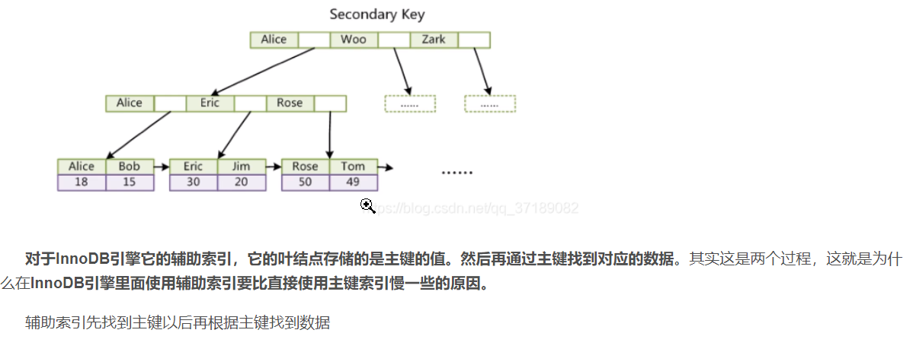
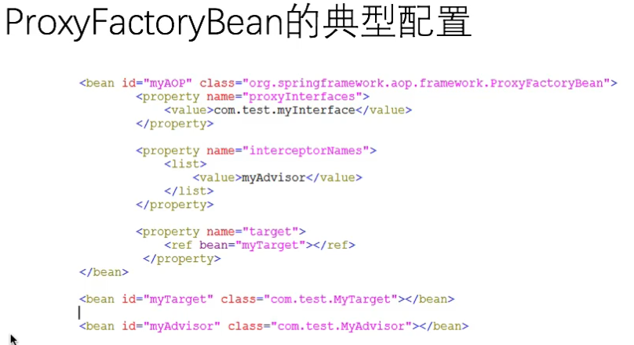
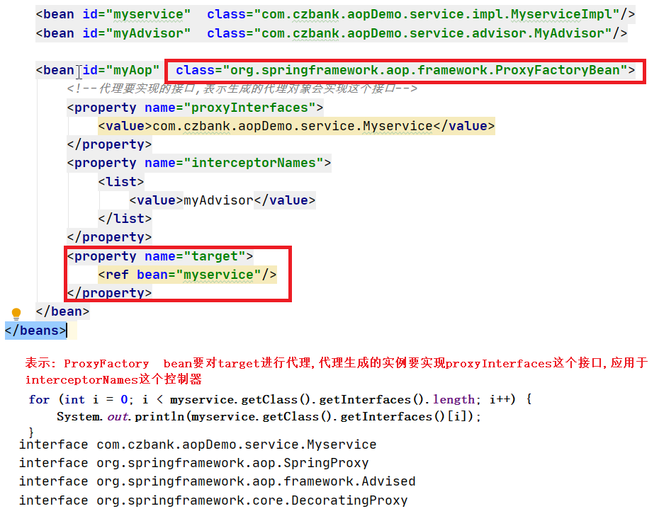

# 

# 共享锁和排它锁

​	共享锁(lock in share mode): select * from test where id=1 lock in share mode;

​	**允许其他事务增加共享锁读取，不允许其他事务增加排他锁，当事务同时增加共享锁时候，事务的更新必须等  待先执行的事务commit后才行，如果同时并发太大可能很容易造成死锁**

​	排它锁(for update)：select * from test where id = 1 for update;

**只有当前的事务可以读取数据，其他的事务不能读取也不能执行更新的操作，结果是超时或者等待第一个事务提交后再执行**

### mysql锁



### B树和B+树




**(1)**B树的树内存储数据，因此查询单条数据的时候，B树的查询效率不固定，最好的情况是O(1)。我们可以认为在做单一数据查询的时候，使用B树平均性能更好。但是，由于B树中各节点之间没有指针相邻，因此B树不适合做一些数据遍历操作。

**(2)**B+树的数据只出现在叶子节点上，因此在查询单条数据的时候，查询速度非常稳定。因此，在做单一数据的查询上，其平均性能并不如B树。但是，B+树的叶子节点上有指针进行相连，因此在做数据遍历的时候，只需要对叶子节点进行遍历即可，这个特性使得B+树非常适合做范围查询。

因此，我们可以做一个推论:没准是Mysql中数据遍历操作比较多，所以用B+树作为索引结构。而Mongodb是做单一查询比较多，数据遍历操作比较少，所以用B树作为索引结构。

### SavePoint

```mysql
start transaction;
insert into auth_group(name) VALUES('caiji_06');
savepoint p1;
insert into auth_group(name) VALUES('caiji_07');
savepoint p2;
rollback to p1;
commit;
```
### B+计算



假设高度为2:一行数据大小为1k,计算

​	单个叶子节点条数: 16k/1k=16条

​	非叶子节点存放指针的个数: 假设主键为bigint:8字节, 指针6字节(InnoDB),一共是14i字节, 16k/14字节=1170

​	高度为2的: 16*1170=18720条

同理: 高度为3的: 1170*1170 * 16=21902400

### 聚集索引

​			https://blog.csdn.net/qq_37189082/article/details/99246581?utm_medium=distribute.pc_relevant.none-task-blog-BlogCommendFromMachineLearnPai2-13.control&dist_request_id=&depth_1-utm_source=distribute.pc_relevant.none-task-blog-BlogCommendFromMachineLearnPai2-13.control

​			聚集还是非聚集指的是B+Tree 叶结点存的是指针还是数据记录

​			MyISAM索引和数据分离，使用的是非聚集索引

​           InnoDB数据文件就是索引文件，主键索引就是聚集索引



### **非聚集索引**

​			




# AOP

advice:通知, 定义在连接处的行为,围绕方法调动而进行注入

pointcut:确定在哪些连接点处应用通知

advisor:通知器,point和Advice的组合

### AOP的实现

​			ProxyFactoryBean 底层实现与源头,作用: **针对目标对象来创建代理对象,将对目标对象方法的调用转到相对应代理对象方法的调用, 并且可以在代理对象方法调用前后执行与之匹配的各个通知器中定义好的方法**

​			组成: **target**:  目标对象,需要对其进行切面增强

​					  **ProxyInterfaces**:代理对象所实现的接口,**注意不是代理对象,代理对象运行过程中,动态生成的**

​					 **InterceptorNames**:通知器(advisor)列表,通知器包括通知(advice)和切点(pointCut)



### 目标代理对象创建

​				JDK动态代理

​				CGLIB

​				ObjenesisCglibAopProxy

### JDK动态代理

​			1.创建一个实现invocationhandler的类,必须实现invoke方法

​			2.创建被代理的类及接口

​			3.通过Proxy的静态方法: newProxyInstance(classLocader,Class[] interfaces,Invocationhandler)创代理

​			4.通过代理调用方法

​		

​	

### Beanfactory和FactoryBean

​	**BeanFactory**是Spring IOC的工厂,它管理着spring所创建的各种Bean对象,当我们在配置文件或者注解中声明了某个bean的id后,通过这个id就可以获取到与该id所对应的class对象的实例(可能新建也可能是缓存中获取)

**FactoryBean**本质是一个bean,同其他bean一样,也是由beanfactory所维护和管理,当然它的实例也会缓存到spring工厂中(如果单例,那么它与普通bean的唯一区别在于,当spring创建另一个factoryBean实例后,它接下来会判断当前所创建的bean是否是一个FactoryBean实例,如果不是,那么就直接将创建出来的bean返还给客户端;如果是,那么它对其进行进一步处理,根据配置文件的target, advisor与interfaces等在运行时动态创建出一个类,并生成该类的一个实例,最后将该实例返还给客户端,因此在声明一个factoryBean的时候,通过id获取到不是这个fanctorybean的实例,而是它动态生成的一个代理对象(通过三种方法来生成 jdk   cglib  objcg))

### 事物不生效

https://zhuanlan.zhihu.com/p/351260443